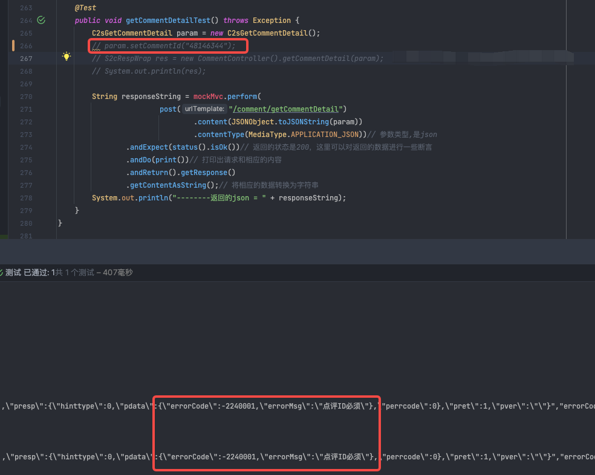

## 什么是javax.validation

JSR303 是一套JavaBean参数校验的标准，它定义了很多常用的校验注解，我们可以直接将这些注解加在我们JavaBean的属性上面(面向注解编程的时代)，就可以省略很多繁琐的串行校验代码。

## 引入依赖包

**可根据需要，自行调整依赖包版本。**

```XML
<!--jsr 303-->
<dependency>
    <groupId>javax.validation</groupId>
    <artifactId>validation-api</artifactId>
    <version>1.1.0.Final</version>
</dependency>
<!-- hibernate validator-->
<dependency>
    <groupId>org.hibernate</groupId>
    <artifactId>hibernate-validator</artifactId>
    <version>5.2.0.Final</version>
</dependency>
```

## 接管validation抛出的异常

`@ControllerAdvice` 是Spring3.2提供的新注解，它是一个Controller增强器 ，可对controller中被 @RequestMapping、@getmapping、@postmapping、@deletemapping注解的方法加一些逻辑处理。

最常用的就是异常处理 `@ControllerAdvice`需要配合`@ExceptionHandler`使用。 当将异常抛到controller时，可以对异常进行统一处理，规定返回的json格式或是跳转到一个错误页面。

validation的异常类是`MethodArgumentNotValidException.class`，下面的代码对validation异常进行捕获并统一返回格式。

```Java
import lombok.extern.slf4j.Slf4j;
import org.springframework.validation.BindingResult;
import org.springframework.web.bind.MethodArgumentNotValidException;
import org.springframework.web.bind.annotation.ControllerAdvice;
import org.springframework.web.bind.annotation.ExceptionHandler;
import org.springframework.web.bind.annotation.ResponseBody;

/**
 * @author ydong
 */
@ControllerAdvice
@Slf4j
public class ValidatorException {

    @ExceptionHandler(MethodArgumentNotValidException.class)
    @ResponseBody
    public S2cRespWrap exceptionHandler(MethodArgumentNotValidException methodArgumentNotValidException) {
        RespBean result = new RespBean();
        BindingResult bindingResult = methodArgumentNotValidException.getBindingResult();
        // 创建封装校验出错信息map
        // HashMap<String, String> errorMap = new HashMap<>();
        // 遍历所有校验出错字段
        // bindingResult.getFieldErrors().forEach(field -> {
        //     errorMap.put(field.getField(), field.getDefaultMessage());
        // });

        String errorMsg = "捕获异常失败";
        if (bindingResult.getAllErrors().size() > 0) {
            errorMsg = bindingResult.getAllErrors().get(0).getDefaultMessage();
        }
        result.setErrorMsg(errorMsg);
        result.setErrorCode(-2240001);
        return UmeCommonRuler.getResponse(result);
    }
}
```

## 简单验证示例

更多用法：搜索引擎搜索“validator”

```Java
import org.hibernate.validator.constraints.NotBlank;
import org.hibernate.validator.constraints.Range;
import javax.validation.constraints.Min;
import javax.validation.constraints.NotNull;

@NotNull(message = "page:页数必须")
@Min(value = 1, message = "page需大于0")
private Integer page;

@NotNull(message = "size必须")
@Range(min = 1, max = 50, message = "size要求在1-50内")
private Integer size;

@NotBlank(message = "酒店ID必须")
private String hotelId;
```



## 自定义注解验证

待补充

## 思考

可使用`@ControllerAdvice`接管特殊异常进行飞书推送，提高异常响应率

## 参考链接

https://blog.csdn.net/xnn_fjj/article/details/100603270
https://blog.csdn.net/Cjava_math/article/details/120001150
https://blog.csdn.net/qq_41175358/article/details/121254789