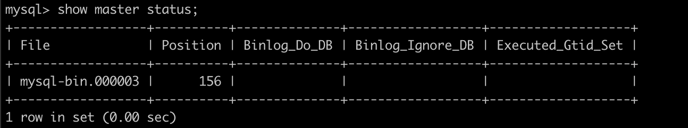
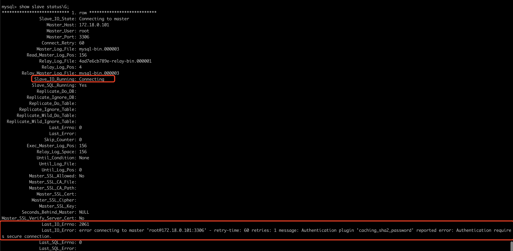
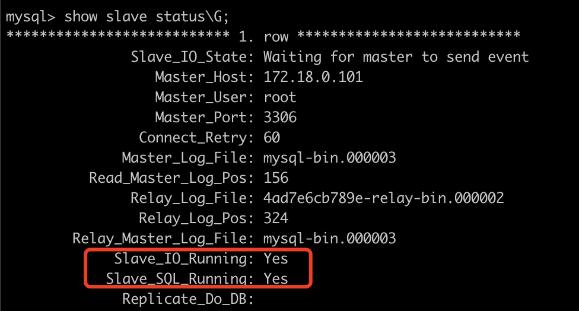
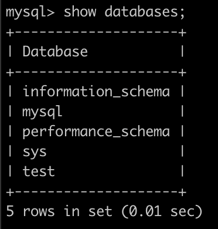

## MySQL读写分离的原理

主库将变更写入`binlog`日志，然后从库连接到主库之后，从库有一个IO线程，将主库的`binlog`日志拷贝到自己本地，写入一个`relay`中继日志中。接着从库中有一个SQL线程会从中继日志读取`binlog`，然后执行`binlog`日志中的内容，也就是在自己本地再次执行一遍SQL，这样就可以保证自己跟主库的数据是一样的。

## 实践环境

系统：macOS
工具：Docker CE

**获取MySQL镜像**

```shell
docker pull mysql:8.0.23
```

**创建容器网络，用于固定mysql容器ip**

```shell
docker network create --subnet=172.18.0.0/24 docker-network
```

## 创建配置文件

master.cnf

```
[mysqld]
#设置此参数表示启用binlog功能，并制定二进制日志的存储目录
log-bin=/var/lib/mysql/mysql-bin
#数据库实例标识
server-id=101
#binlog 日志格式
binlog-format=MIXED
```

slave.cnf

```
[mysqld]
#设置此参数表示启用binlog功能，并制定二进制日志的存储目录
log-bin=/var/lib/mysql/mysql-bin
#数据库实例标识
server-id=102
#binlog 日志格式
binlog-format=MIXED
```

## 启动两个MySQL容器

Master

```shell
docker run \
-p 3306:3306 \
-v /mysql/master.cnf:/etc/mysql/conf.d/replication.cnf \
-v /mysql/master/data/:/var/lib/mysql \
--net docker-network --ip 172.18.0.101 \
--name mysql-master -e MYSQL_ROOT_PASSWORD=123456 -d mysql:8.0.23
```

Slave

```shell
docker run \
-p 3307:3306 \
-v /mysql/slave.cnf:/etc/mysql/conf.d/replication.cnf \
-v /mysql/slave/data/:/var/lib/mysql \
--net docker-network --ip 172.18.0.102 \
--name mysql-slave -e MYSQL_ROOT_PASSWORD=123456 -d mysql:8.0.23
```

## 配置主从复制

进入mysql-master容器

```shell
docker exec -it mysql-master bash
```

登陆MySQL查看master状态

```shell
show master status;
```



进入mysql-slave容器

```shell
docker exec -it mysql-slave bash
```

执行mysql命令

```mysql
change master to master_host='172.18.0.101',
master_user='root',
master_password='123456',
master_log_file='mysql-bin.000003',
master_log_pos=156;
```

启动slave

```mysql
start slave;
```

查看slave是否成功

```mysql
show slave status \G;
```



这两个状态都为Yes才代表成功

```mysql
Slave_IO_Running: Yes 
Slave_SQL_Running: Yes 
```

通过截图所示错误（不安全的连接），在mysql-slave中执行以下命令

```
mysql --ssl-mode=DISABLED -h 172.18.0.101 -uroot -p123456 --get-server-public-key
```

参考链接：[https://www.cnblogs.com/summertime-wu/p/11637520.html](https://www.cnblogs.com/summertime-wu/p/11637520.html)

重新登入mysql-slave数据库查看slave状态



在mysql-master创建一个库

```mysql
create database test;
```

在mysql-slave mysql中执行`show databases;`



成功！