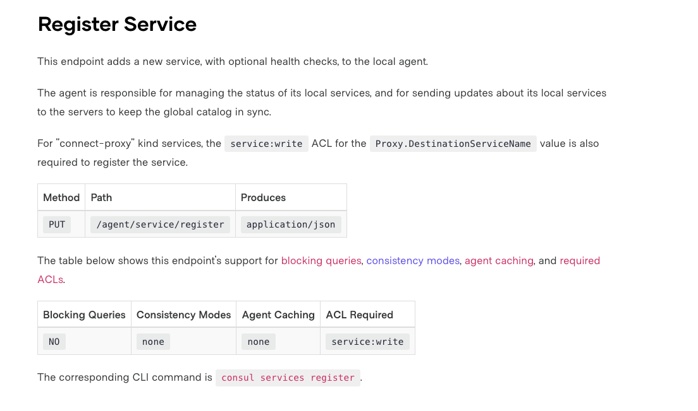
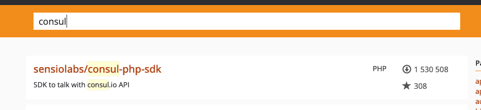
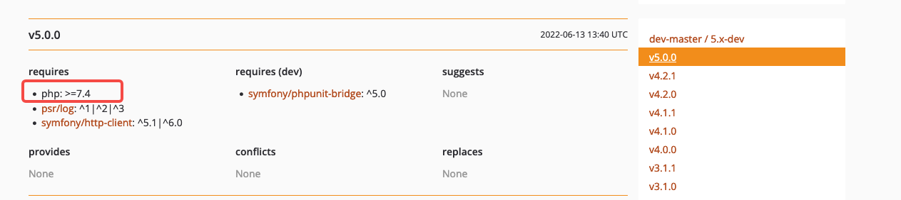
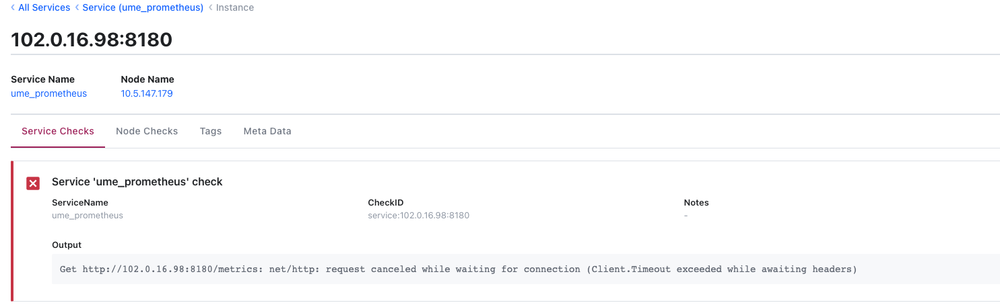

## 了解Consul

Consul 是一种服务网格解决方案，提供具有服务发现、配置和分段功能的全功能控制平面。这些功能中的每一个都可以根据需要单独使用，也可以一起使用以构建完整的服务网格。

### 如何注册

文档：[https://www.consul.io/api-docs/agent/service](https://www.consul.io/api-docs/agent/service)



## 引入软件包

### Composer

PHP的软件包管理系统，它提供用于管理PHP软件和依赖库关系的标准格式。

### 搜索软件包

composer软件包地址：https://packagist.org/



### 根据PHP版本引入扩展包



我的php版本是`7.2`，所以我选择了`v4.2.1`版本。
`composer require sensiolabs/consul-php-sdk:v4.2.1`

## 注册Consul

### php注册代码

```PHP
public function actionConsulRegister()
{
    // 只注册一台到consul
    $redisKey = "SERVICE:CONSULREGISTER";
    $predis = \Yii::$app->predis;
    $result = $predis->client->get($redisKey);
    if ($result) {
        echo "no";
        exit;
    }
    $result = $predis->client->set($redisKey, 1);
    $expireTime = 60;
    $predis->client->expire($redisKey, $expireTime);

    putenv("CONSUL_HTTP_ADDR=CONSUL_URL");
    $kv = new \SensioLabs\Consul\Services\Agent();
    $port = "80";
    $ip = getHostByName(getHostName());
    $array = [
        'id' => "{$ip}:{$port}",
        'name' => 'prometheus',
        'tags' => ['prometheus_v1'],
        'address' => $ip,
        'port' => (int)$port,
        'enabletagoverride' => false,
        'check' => array(
            // 'deregistercriticalserviceafter' => '90m',
            'http' => "http://{$ip}:{$port}/metrics",
            'interval' => "15s",
        )
    ];
    $kv->registerService($array);
    echo "success";
    exit;
}
```

### 代码释义

```PHP
// 只注册一台到consul
$redisKey = "HTL:HOTELDETAIL:CONSULREGISTER";
$predis = \Yii::$app->predis;
$result = $predis->client->get($redisKey);
if ($result) {
    echo "no";
    exit;
}
$result = $predis->client->set($redisKey, 1);
$expireTime = 60;
$predis->client->expire($redisKey, $expireTime);
```

#### 为什么要有redis锁

因php不能像java一样自请求，是通过容器增加启动钩子访问容器内的php服务注册consul，由于php的promethues数据是存在redis中，如果注册两台会造成prometheus获取的打点数据double。

#### consul注册参数

```PHP
// consul地址
putenv("CONSUL_HTTP_ADDR=CONSUL_URL");
$kv = new \SensioLabs\Consul\Services\Agent();
$port = "80";
// 获取本机ip
$ip = getHostByName(getHostName());
$array = [
    // 服务id
    'id' => "{$ip}:{$port}",
    // 服务名称
    'name' => 'prometheus',
    // 服务tag，数组，自定义，可以根据这个tag来区分同一个服务名的服务
    'tags' => ['prometheus_v1'],
    // 服务注册到consul的IP，服务发现，发现的就是这个IP
    'address' => $ip,
    // 服务IP对应端口号
    'port' => (int)$port,
    'enabletagoverride' => false,
    'check' => array(
        // 如果服务启动失败，多少时间内注销consul上的该服务。单位：minute
        // 'deregistercriticalserviceafter' => '90m',
        // 指定健康检查的URL，调用后只要返回20X，consul都认为是健康的
        'http' => "http://{$ip}:{$port}/metrics",
        // 健康检查间隔时间
        'interval' => "15s",
    )
];
$kv->registerService($array);
```

**deregisterCriticalServiceAfter：** 由于consul是安装在虚拟机上无法访问容器服务，所以不设置该参数，避免自动注销注册。

### 注册结果

