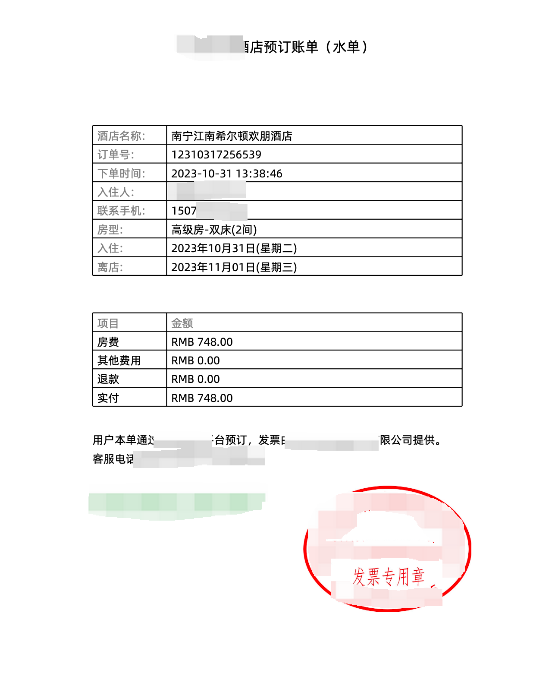

## 什么是Apache PDFBox

Apache PDFBox是一个开源的Java库，用于处理和操作PDF文档。它提供了一组功能强大的API，可以用于创建、修改、提取内容和元数据、加密、签名以及验证PDF文档。

以下是Apache PDFBox的一些主要特点和功能：

1. 创建和编辑PDF文档：Apache PDFBox允许你使用Java代码创建新的PDF文档，并且可以添加文本、图像、表格、链接和其他元素。它还提供了修改现有PDF文档的功能，如添加、删除和更新页面、注释、书签等。
    
2. 提取和操作内容：你可以使用Apache PDFBox提取PDF文档中的文本、图像和其他内容。它支持文本搜索、文本替换、图像提取、页面提取等操作，使你能够对PDF文档中的内容进行灵活的处理。
    
3. 加密和签名：Apache PDFBox支持对PDF文档进行加密和数字签名，以确保文档的安全性和完整性。你可以使用不同的加密算法和密钥长度来保护PDF文档，并且可以使用数字证书对文档进行签名。

最重要的是不需要**商业许可**

## 下载字体

阿里巴巴普惠体是一套全球永久免费正版商用的字体家族。阿里巴巴普惠体3.0为一套符合新国家标准GB18030-2022的简体中文字符集，包含GB18030-2022强制规范三个实现级别：实现级别1＋实现级别2标准规格的7字重、实现级别3标准规格的Regular 单一字重。7字重共194,460个全形汉字。包含拉丁字母、希腊字母、西里尔字母、标点符号。

下载字体：Alibaba PuHuiTi 3.0 - 55 Regular [阿里巴巴普惠体 (alibabagroup.com)](https://fonts.alibabagroup.com/#/font)

放到resources目录


## 代码实现
### pom 引入

```pom
<dependency>
    <groupId>org.apache.pdfbox</groupId>
    <artifactId>pdfbox</artifactId>
    <version>2.0.27</version>
</dependency>
```

### 代码示例
```
import cn.hutool.core.date.DateUtil;  
import cn.hutool.core.util.NumberUtil;  
import com.umetrip.hotel.order.constants.LogSchemaOrder;  
import com.umetrip.hotel.order.constants.OrderErrorCode;  
import com.umetrip.hotel.order.service.dto.Result;  
import com.umetrip.hotel.order.service.iface.HotelReceiptService;  
import com.umetrip.hotel.order.service.iface.dto.ProducePdfRequest;  
import lombok.extern.slf4j.Slf4j;  
import org.apache.pdfbox.pdmodel.PDDocument;  
import org.apache.pdfbox.pdmodel.PDDocumentInformation;  
import org.apache.pdfbox.pdmodel.PDPage;  
import org.apache.pdfbox.pdmodel.PDPageContentStream;  
import org.apache.pdfbox.pdmodel.common.PDRectangle;  
import org.apache.pdfbox.pdmodel.font.PDType0Font;  
import org.apache.pdfbox.pdmodel.graphics.image.JPEGFactory;  
import org.apache.pdfbox.pdmodel.graphics.image.PDImageXObject;  
import org.springframework.stereotype.Service;  
  
import java.awt.Color;  
import java.io.IOException;  
import java.io.InputStream;  
import java.util.Arrays;  
import java.util.List;
public class HotelReceiptServiceImpl implements HotelReceiptService {  
  
    private PDPageContentStream contentStream;  
  
    @Override  
    public Result<String> producePdf(ProducePdfRequest producePdfRequest) {  
        try (PDDocument document = new PDDocument()) {  
            PDPage page = new PDPage(PDRectangle.A4);  
            document.addPage(page);  
            // 创建 PDDocumentInformation 对象  
            PDDocumentInformation pdd = document.getDocumentInformation();  
            // 设置文档的作者  
            pdd.setAuthor("航旅纵横");  
            // 设置文档的标题  
            pdd.setTitle("航旅纵横酒店预订账单（水单）");  
  
            contentStream = new PDPageContentStream(document, page);  
            InputStream inFont = this.getClass().getClassLoader().getResourceAsStream("font/AlibabaPuHuiTi-3-55-Regular.ttf");  
            PDType0Font font = PDType0Font.load(document, inFont);  
            // 设置标题的字体大小  
            float fontSize = 15;  
            contentStream.setFont(font, fontSize);  
            // 设置标题文本  
            String title = "航旅纵横酒店预订账单（水单）";  
            float titleWidth = font.getStringWidth(title) / 1000 * fontSize;  
            float titleHeight = font.getFontDescriptor().getFontBoundingBox().getHeight() / 1000 * fontSize;  
            float startX = (page.getMediaBox().getWidth() - titleWidth) / 2;  
            // 从页面顶部向下50点开始  
            float startY = page.getMediaBox().getHeight() - titleHeight - 50;  
            showTextByLeft(title, "", startX, startY);  
  
            contentStream.setFont(font, 12);  
            List<String> titleList = Arrays.asList("酒店名称:", "订单号:", "下单时间:", "入住人:", "联系手机:", "房型:", "入住:", "离店:", "");  
            String checkin = producePdfRequest.getCheckin() + "(" + DateUtil.dayOfWeekEnum(DateUtil.parse(producePdfRequest.getCheckin())).toChinese() + ")";  
            String checkout = producePdfRequest.getCheckout() + "(" + DateUtil.dayOfWeekEnum(DateUtil.parse(producePdfRequest.getCheckout())).toChinese() + ")";  
            List<String> valueList = Arrays.asList(  
                    producePdfRequest.getHotelName(),  
                    producePdfRequest.getOrderNo(),  
                    producePdfRequest.getOrderTime(),  
                    producePdfRequest.getOccupant(),  
                    producePdfRequest.getPhone(),  
                    producePdfRequest.getRoomType(),  
                    checkin,  
                    checkout,  
                    ""  
            );  
            pdfTable(page, 150, 8, 2, titleList, valueList);  
  
            titleList = Arrays.asList("项目", "房费", "其他费用", "退款", "实付", "");  
            String actualPayment = NumberUtil.round(NumberUtil.sub(producePdfRequest.getPayAmount(), producePdfRequest.getRefundAmount()), 2).toString();  
            valueList = Arrays.asList(  
                    "金额",  
                    "RMB " + NumberUtil.round(producePdfRequest.getPayAmount(), 2),  
                    "RMB 0.00",  
                    "RMB " + NumberUtil.round(producePdfRequest.getRefundAmount(), 2),  
                    "RMB " + actualPayment,  
                    ""  
            );  
            pdfTable(page, 350, 5, 2, titleList, valueList);  
  
  
            showTextByLeft(String.format("用户本单通过航旅纵横平台预订，发票由%s提供。", producePdfRequest.getReceiptIssuer()), "", 100, page.getMediaBox().getHeight() - 490);  
            showTextByLeft(String.format("客服电话%s", producePdfRequest.getReceiptTel()), "", 100, page.getMediaBox().getHeight() - 510);  
  
            InputStream logoFile = this.getClass().getClassLoader().getResourceAsStream("invoice/航旅纵横酒店.jpeg");  
            PDImageXObject logo = JPEGFactory.createFromStream(document, logoFile);  
            // 缩放因子  
            float logoScale = 0.4f;  
            contentStream.drawImage(logo, 100, page.getMediaBox().getHeight() - 560, logo.getWidth() * logoScale, logo.getHeight() * logoScale);  
            if (producePdfRequest.getIsStamp() == 1) {  
                InputStream imageFile = this.getClass().getClassLoader().getResourceAsStream("invoice/电子印章.jpeg");  
                PDImageXObject image = JPEGFactory.createFromStream(document, imageFile);  
                float scale = 0.3f;  
                contentStream.drawImage(image, page.getMediaBox().getWidth() - 270, page.getMediaBox().getHeight() - 670, image.getWidth() * scale, image.getHeight() * scale);  
            }  
            contentStream.close();  
            String file = String.format("/opt/applog/MskyLog/umehotel-order-service/航旅纵横水单%s.pdf", producePdfRequest.getOrderNo());  
            document.save(file);  
            return Result.success(file);  
        } catch (IOException e) {  
            log.error(LogSchemaOrder.ERROR_KEY_REQUEST_EXCEPTION, "producePdf", producePdfRequest, e);  
            return Result.fail(OrderErrorCode.SYSTEM_ERROR);  
        }  
    }  
  
    /**  
     * pdf表格生成  
     *  
     * @param page      pdf页  
     * @param yStart    上边距  
     * @param rows      行数  
     * @param cols      列数  
     * @param titleList 固定标题  
     * @param valueList 动态值  
     * @throws IOException io  
     */    private void pdfTable(PDPage page, float yStart, int rows, int cols, List<String> titleList, List<String> valueList) throws IOException {  
        // 开始绘制表格  
        float margin = 100;  
        // top margin  
        yStart = page.getMediaBox().getHeight() - yStart;  
        // 表格宽度  
        float tableWidth = page.getMediaBox().getWidth() - 2 * 100;  
  
        // 单元格高度  
        float rowHeight = 20f;  
  
        // 表格高度  
        float tableHeight = rowHeight * rows;  
        // 单元格宽度  
        float colWidth = tableWidth / (float) cols;  
        // 第一列单元格宽度  
        float firstColumnWidth = tableWidth * 20 / 100;  
  
        // 染色  
        List<String> stainList = Arrays.asList("酒店名称:", "订单号:", "下单时间:", "入住人:", "联系手机:", "房型:", "入住:", "离店:", "项目", "金额");  
  
        // 绘制行  
        for (int i = 0; i <= rows; i++) {  
            contentStream.moveTo(margin, yStart - i * rowHeight);  
            contentStream.lineTo(margin + tableWidth, yStart - i * rowHeight);  
  
            contentStream.setNonStrokingColor(Color.black);  
            if (stainList.contains(titleList.get(i))) {  
                contentStream.setNonStrokingColor(Color.gray);  
            }  
            showTextByLeft(titleList.get(i), "", margin + 5, yStart - i * rowHeight - 15);  
            contentStream.setNonStrokingColor(Color.black);  
            if (stainList.contains(valueList.get(i))) {  
                contentStream.setNonStrokingColor(Color.gray);  
            }  
            showTextByLeft(valueList.get(i), "", margin + firstColumnWidth + 5, yStart - i * rowHeight - 15);  
        }  
  
        // 绘制列  
        for (int i = 0; i <= cols; i++) {  
            float colWidthSpe = colWidth;  
            if (i == 1) {  
                colWidthSpe = firstColumnWidth;  
            }  
            contentStream.moveTo(margin + i * colWidthSpe, yStart);  
            contentStream.lineTo(margin + i * colWidthSpe, yStart - tableHeight);  
        }  
  
        contentStream.stroke();  
    }  
  
    /**  
     * 文本添加  
     *  
     * @param txt 添加文本  
     * @param def 默认文本  
     * @param x   x轴  
     * @param y   y轴  
     * @throws IOException IOException  
     */    private void showTextByLeft(String txt, String def, float x, float y) throws IOException {  
        // Begin the Content stream  
        contentStream.beginText();  
        // contentStream.setWordSpacing(0.01F);  
        if (null == txt) {  
            txt = def;  
        }  
  
        // Setting the position for the line  
        contentStream.newLineAtOffset(x, y);  
  
        // Adding text in the form of string  
        contentStream.showText(txt);  
  
        // Ending the content stream  
        contentStream.endText();  
    }  
}
```

## 实现效果
