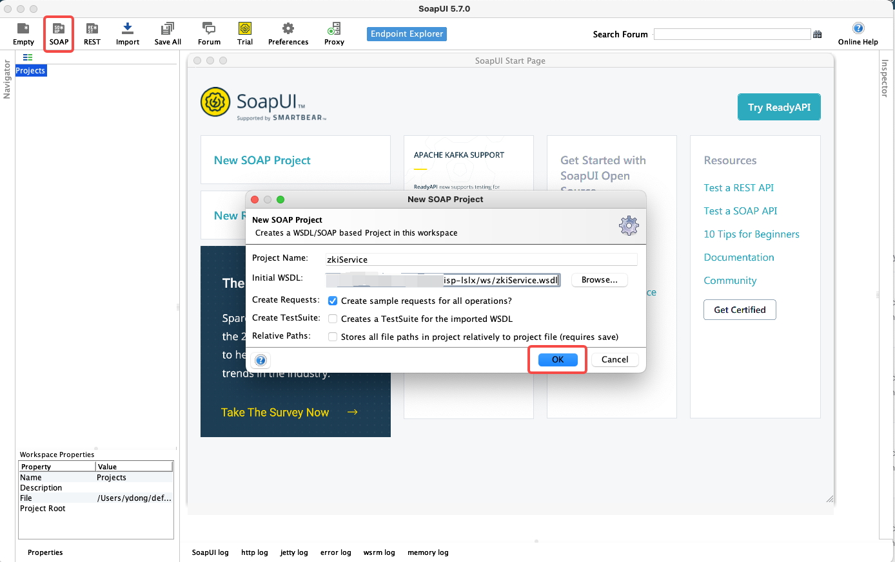
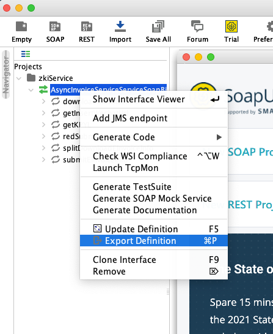
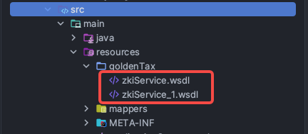

## [什么是WSDL](https://www.ibm.com/docs/zh/integration-bus/10.0?topic=services-what-is-wsdl)

WSDL 是用于描述 Web Service 的一种 XML 表示法。 WSDL 定义告诉客户如何编写 Web Service 请求，并且描述了由 Web Service 提供程序提供的接口。

## [SoapUI简介](https://www.cnblogs.com/hong-fithing/p/7591751.html)

SoapUI是一个开源测试工具，通过soap/http来检查、调用、实现Web Service的功能/负载/符合性测试。该工具既可作为一个单独的测试软件使用，也可利用插件集成到Eclipse，maven2.X，Netbeans 和intellij中使用。

SoapUI是一个自由和开放源码的跨平台功能测试解决方案。通过一个易于使用的图形界面和企业级功能，SoapUI让您轻松， 快速创建和执行自动化功能、回归、合规和负载测试。在一个测试环境，SoapUI提供完整的测试覆盖，并支持所有的标准协议和技术。

## 对接流程

### 下载wsdl文件
启动一个wsdl服务


导出wsdl文件  


把wsdl文件放入resources目录  


### pom引入

```
<plugin>
    <groupId>org.codehaus.mojo</groupId>
    <artifactId>jaxws-maven-plugin</artifactId>
    <version>2.6</version>
    <executions>
        <execution>
            <goals>
                <goal>wsimport</goal>
            </goals>
            <configuration>
                <!--<wsdlUrls>-->
                    <!--<wsdlUrl>${basedir}/src/main/resources/goldenTax/zkiService_1.wsdl</wsdlUrl>-->
                <!--</wsdlUrls>-->
                <wsdlDirectory>${project.basedir}/src/main/resources/goldenTax</wsdlDirectory>
                <wsdlFiles>
                    <wsdlFile>zkiService_1.wsdl</wsdlFile>
                </wsdlFiles>
                <wsdlLocation>http://example.com/eisp-lslx/ws/zkiService?wsdl</wsdlLocation>
                <!--<wsdlLocation>${project.build.directory}/goldenTax/zkiService_1.wsdl</wsdlLocation>-->
                <packageName>com.umetrip.hotel.proxy.service.wsdl.goldenTax</packageName>
            </configuration>
        </execution>
    </executions>
</plugin>
```

`wsdlFiles` 指定用于生成Java代码的WSDL文件。
`wsdlLocation`  指定运行时应用程序中的WSDL文件位置，一般来说都是引用本地文件。由于我用不到pom里面的配置，我就直接写了一个wsdl文件的地址。

### 代码调整
ZKInvoiceService 和 AsyncInvoiceServiceService 为wsdl文件生成的类
```java
private ZKInvoiceService getAsyncInvoiceServiceService() {
    // 获取代理配置
    String proxyName = ApolloUtil.getNamespaceConfig(ApolloConstant.GOLDEN_TAX, "proxyName", "hotel:jinshui");
    // 获取代理地址
    String baseUrl = UmeProxyUtil.getProxy(proxyName);
    if (StringUtils.isEmpty(baseUrl)) {
        baseUrl = "http://example.com";
    }
    // 拼接金税接口请求地址
    String apiUrlPath = ApolloUtil.getNamespaceConfig(ApolloConstant.GOLDEN_TAX, "apiUrlPath", "/eisp-lslx/ws/zkiService");
    String url = baseUrl + apiUrlPath;

    // 获取打包文件夹内的wsdl文件流
    URL wsdlLocation = this.getClass().getResource("/goldenTax/zkiService_1.wsdl");
    // 修改在pom中设置的wsdlLocation
    AsyncInvoiceServiceService asyncInvoiceServiceService = new AsyncInvoiceServiceService(wsdlLocation);
    ZKInvoiceService zkInvoiceService = asyncInvoiceServiceService.getAsyncInvoiceServicePort();
    BindingProvider bindingProvider = (BindingProvider) zkInvoiceService;
    // 修改请求的接口地址（soap:address location）
    bindingProvider.getRequestContext().put(BindingProvider.ENDPOINT_ADDRESS_PROPERTY, url);
    return zkInvoiceService;
}
```

### 备注
1. 由于打包和运行不在同一个环境内，生成的Java代码一直找不到pom文件 `wsdlLocation` 配置的wsdl文件，所以在代码内部重新引入运行时需要用到的wsdl文件。
2. 如果没有正向代理不需要修改请求的接口地址（soap:address location）。